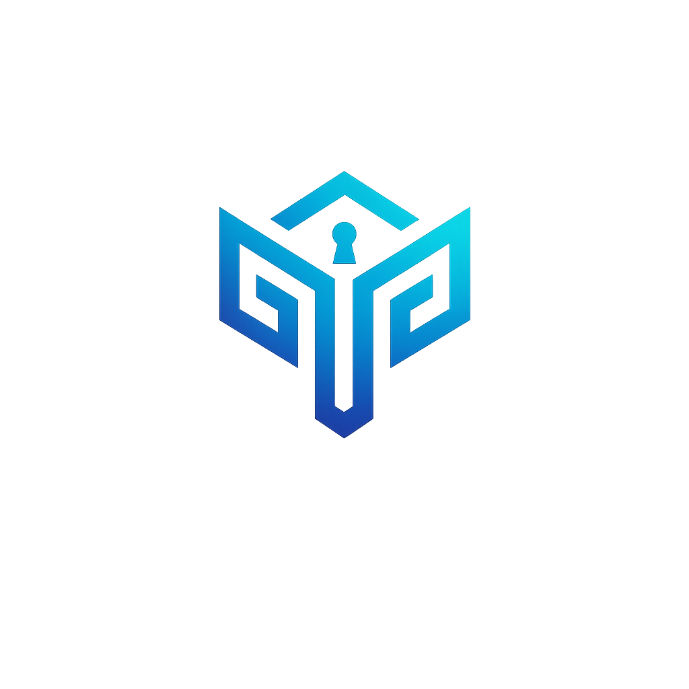

<div align="center">
  
</div>

# Tamga Vault
**Tamga** is a modern, comprehensive digital vault and security management platform designed specifically for developers and privacy-conscious users. It features a robust **local-first** and **zero-knowledge** architecture.

> 🏺 **Why "Tamga"?** 
> *Tamga* comes from ancient Turkic culture and means a **seal or tribal mark** used to represent identity, ownership, and authority. 
> 
> *Tamga = A digital seal. Your data is yours. Your control.* 🔐

## 🎯 The Core Mission
The goal of Tamga is to protect your most sensitive digital assets (passwords, 2FA codes, passkeys, and API environment variables) without demanding blind trust in cloud servers. Everything is stored, managed, and encrypted exclusively on your own hardware using military-grade security standards.

---

## 🌟 Key Features

### 🧩 1. The Ultimate Developer Vault
- **Password Manager & Generator**: Create incredibly strong passwords and store them securely categorized by platform or username. Keeps historical track of your password modifications.
- **Developer `.env` Storage**: Do not leave unencrypted `.env` files lying around your computer where malware can scrape them. Store them securely in Tamga.
- **Desktop Authenticator (TOTP)**: Generate live 6-digit OTP codes right on your desktop.
  - **Google Authenticator Importer**: Use your webcam or screenshots to decode Google's proprietary QR export (`otpauth-migration://`) and pull dozens of accounts into Tamga instantly!
- **Passkeys & Recovery Codes**: Securely tuck away your backup rescue codes and raw digital passkeys in custom categories.

### 🕸️ 2. Advanced Relational Linking
- **Bi-Directional Credential Linking**: Connect multiple assets. Have a server password alongside an API `.env` file? Link them together!
- **Interactive Security Hub**: Clicking on an item doesn't just show its details. It opens a unified Hub combining *all* linked files into a single, seamless vertical dashboard where you can copy passwords, read OTPs, and manage `.env` files all at once.
- **Relational Graph View**: Tamga maps out your security architecture. Enter the **Graph View** to see a beautiful, interactive node-and-edge flowchart detailing how your credentials, groups, and files are interconnected.

### 🎭 3. Intuitive Control UX
- **Drag-and-Drop Organizations**: Drag items across your screen to seamlessly reorder your vaults.
- **Shift-to-Merge Groups**: Hold the <kbd>Shift</kbd> key while dropping an item to nest them together into custom logical folders! Readjust, disband, and rename groups easily.
- **Privacy Screen (Blur Mode)**: Sharing your screen on a Zoom call? Enable Tamga's *Blur Mode* to instantly shroud all your passwords and keys behind a frosted glass layer. They reveal themselves smoothly only when explicitly hovered over.

---

## 🔒 Security & Technical Architecture
- **Zero-Knowledge Cloudless Model**: Tamga **never** sends your credentials to the internet. 
- **Encryption**: Powered by standard, robust Web Crypto API `SubtleCrypto`.
- **Algorithm**: Your global Master Password runs through extensive **PBKDF2** derivations to create an unlocking key. The actual vault files are encrypted via local **AES-GCM (256-bit)**. 
- **Stack**: Built with React, Vite.js, completely standalone running locally on an Electron engine. UI crafted with Tailwind CSS and Radix components.

---

## 🚀 Installation & Development

### Prerequisites
- [Node.js](https://nodejs.org/) (v18 or later recommended)
- npm

### Quick Start
```bash
# 1. Clone the repository
git clone https://github.com/osmn-byhn/tamga.git
cd tamga

# 2. Install dependencies
npm install

# 3. Start the application
npm run electron:dev
```
*Note: Hot-reloading is fully enabled. Any changes made to the React frontend in `src/` will refresh instantly inside the Electron instance.*

### Packaging for Production
```bash
npm run make
```
*Compiled output distributions (`.zip`, `.rpm`, `.deb`, `.AppImage`) will be seamlessly generated via Electron Forge.*

---
<div align="center">
<i>Tamga is a modern digital seal that gives you complete sovereignty over your digital infrastructure.</i>
</div>
